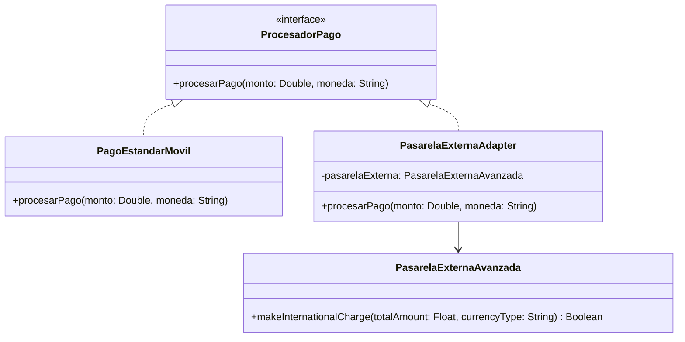

# Patrón Adapter (Adaptador)

## Problema
En el desarrollo con Kotlin Multiplatform, a menudo integramos SDKs nativos de iOS/Android, librerías de terceros o servicios backend heredados (*legacy*). El problema surge cuando estas herramientas externas tienen interfaces, nombres de métodos o tipos de datos completamente incompatibles con la arquitectura limpia o las interfaces estándar que nuestra aplicación ya utiliza. Modificar el código fuente de esas librerías externas suele ser imposible o inviable.

## Solución
El patrón **Adapter** actúa como un puente o traductor. Introduce una clase intermedia (`PasarelaExternaAdapter`) que implementa la interfaz que el cliente espera (`ProcesadorPago`) y por dentro envuelve al objeto incompatible (`PasarelaExternaAvanzada`). Cuando el cliente invoca un método estandarizado, el adaptador traduce los parámetros y redirige la llamada al formato que el sistema externo comprende.

## Diagrama de Clases

## Participantes
| Rol del Patrón | Clase/Interfaz en el Código | Descripción |
| :--- | :--- | :--- |
| **Target (Objetivo)** | `ProcesadorPago` | La interfaz de dominio que la aplicación cliente conoce y utiliza. |
| **Adaptee (Adaptado)** | `PasarelaExternaAvanzada` | El componente externo o legacy con una interfaz incompatible que necesita adaptarse. |
| **Adapter (Adaptador)** | `PasarelaExternaAdapter` | Clase que adapta el `Adaptee` a la interfaz `Target`. |
| **Cliente** | `Demo.kt` | Código de la aplicación que interactúa exclusivamente a través de la interfaz Target. |

## Kotlin Idiomático
- **Composición sobre herencia:** En Kotlin se prefiere la variante de adaptador por *composición* (pasar la instancia externa en el constructor privado), lo cual es más flexible que la herencia múltiple y previene acoplamientos rígidos.
- **Conversión de tipos seguros:** Permite adaptar fácilmente incompatibilidades de tipos primitivos (como convertir un `Double` de la app a un `Float` que exija el SDK externo).

## Cuándo NO usarlo
1. **Cuando puedes modificar el código original:** Si tienes control total sobre la clase externa y es fácil cambiar su interfaz para adaptarla al estándar del proyecto, un adapter añade una capa de indirección innecesaria.
2. **Si las interfaces son casi idénticas:** Si la diferencia es mínima, a veces un simple refactor o función de extensión en Kotlin es suficiente en lugar de crear una clase adaptador completa.

## Patrones Relacionados
- **Facade:** El Adapter cambia la interfaz de un objeto existente para hacerlo compatible; el Facade crea una interfaz completamente nueva y simplificada para un subsistema.
- **Decorator:** Es estructuralmente similar (envuelve a otro objeto), pero el Decorator añade responsabilidades o comportamientos adicionales sin alterar la interfaz, mientras que el Adapter cambia la interfaz para ajustarla a lo esperado.