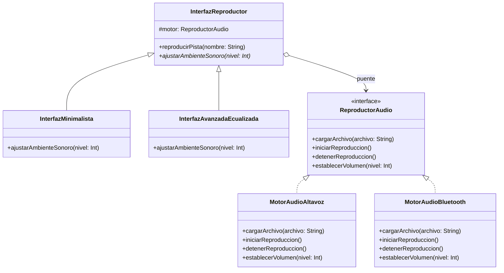

# Patrón Bridge (Puente)

## Problema
En el desarrollo de una aplicación multimedia multiplataforma, nos enfrentamos a un crecimiento exponencial de clases si queremos soportar múltiples tipos de interfaces de usuario (`InterfazMinimalista`, `InterfazAvanzadaEcualizada`, `InterfazCarPlay`) y múltiples motores de reproducción de audio hardware (`MotorAudioAltavoz`, `MotorAudioBluetooth`, `MotorAudioHDMI`). Si tuviéramos que crear una clase por cada combinación posible, el código se volvería inmanejable ante cualquier nuevo cambio en los controles o en el hardware.

## Solución
El patrón **Bridge** desacopla la abstracción (`InterfazReproductor`) de su implementación de bajo nivel (`ReproductorAudio`) mediante una relación de composición (el "puente"). Gracias a esto, ambas jerarquías de clases pueden evolucionar y extenderse de manera totalmente independiente: podemos añadir nuevas interfaces visuales sin tocar el código de los motores de audio, y viceversa.

## Diagrama de Clases

## Participantes
| Rol del Patrón | Clase/Interfaz en el Código | Descripción |
| :--- | :--- | :--- |
| **Abstracción** | `InterfazReproductor` | Define la interfaz de control de alto nivel y mantiene la referencia al implementador. |
| **Abstracción Refinada** | `InterfazMinimalista`, `InterfazAvanzadaEcualizada` | Extienden los tipos de interfaces de usuario añadiendo lógica de control específica. |
| **Implementador** | `ReproductorAudio` | Define la interfaz de bajo nivel común para todos los motores de audio y hardware. |
| **Implementadores Concretos** | `MotorAudioAltavoz`, `MotorAudioBluetooth` | Clases técnicas reales que ejecutan el procesamiento de audio físico o inalámbrico. |
| **Cliente** | `Demo.kt` | Conecta las abstracciones de interfaz con los motores implementadores y ejecuta el sistema. |

## Kotlin Idiomático
- **Composición mediante Constructor (`protected val motor`):** Uso del constructor primario en clases abstractas para inyectar y almacenar la referencia del implementador de forma limpia y segura.
- **Interfaces desacopladas:** Uso de contratos claros para aislar la lógica de presentación multimedia de los detalles de hardware.

## Cuándo NO usarlo
1. **Sistemas estáticos o únicos:** Si tu aplicación solo tendrá una única interfaz de usuario y un único motor de audio que jamás cambiarán, usar Bridge añade indirección innecesaria.
2. **Jerarquías rígidas sin crecimiento:** Si no existe la necesidad de variar dimensiones de forma independiente, la complejidad del patrón no se justifica.

## Patrones Relacionados
- **Adapter:** Se enfoca en hacer que clases con interfaces incompatibles colaboren (habitualmente de manera reactiva). El Bridge se diseña preventivamente para permitir que dos jerarquías varíen independientemente.
- **Abstract Factory:** Puede emplearse para crear y ensamblar familias de objetos relacionados bajo la estructura del Bridge.