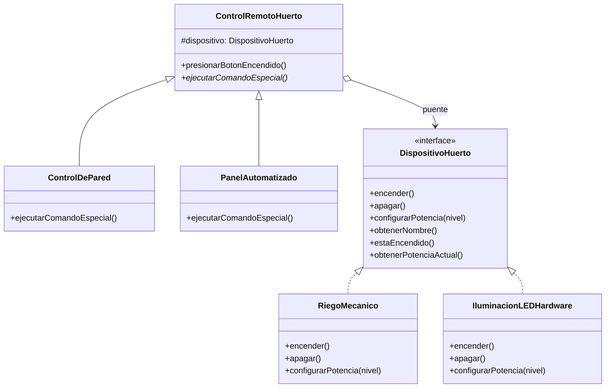

# Patrón Bridge (Puente)

## Problema
En el desarrollo del software de control para el huerto inteligente, nos enfrentamos a un problema de crecimiento exponencial de clases si queremos soportar múltiples tipos de interfaces de control (ej. `ControlDePared`, `PanelAutomatizado`, `ControlMovil`) y múltiples tipos de hardware (ej. `RiegoMecanico`, `IluminacionLEDHardware`). Si creáramos una clase por cada combinación posible (como `ControlDeParedRiego`, `PanelAutomatizadoLED`, etc.), el número de clases estallaría rápidamente al añadir nuevos dispositivos o controles.

## Solución
El patrón **Bridge** desacopla una abstracción (`ControlRemotoHuerto`) de su implementación (`DispositivoHuerto`) mediante una relación de composición (el "puente"). De esta forma, ambas jerarquías de clases pueden extenderse y variar de manera completamente independiente: podemos crear nuevos controles sin tocar el hardware, y viceversa.

## Diagrama de Clases

## Participantes
| Rol del Patrón | Clase/Interfaz en el Código | Descripción |
| :--- | :--- | :--- |
| **Abstracción** | `ControlRemotoHuerto` | Define la interfaz de control de alto nivel y mantiene la referencia al implementador. |
| **Abstracción Refinada** | `ControlDePared`, `PanelAutomatizado` | Extienden las variantes de control añadiendo lógica específica. |
| **Implementador** | `DispositivoHuerto` | Define la interfaz de bajo nivel común para todos los dispositivos de hardware. |
| **Implementadores Concretos** | `RiegoMecanico`, `IluminacionLEDHardware` | Clases técnicas reales que ejecutan las operaciones físicas. |
| **Cliente** | `Demo.kt` | Conecta las abstracciones con los implementadores y ejecuta el sistema. |

## Kotlin Idiomático
- **Composición mediante Constructor (`protected val dispositivo`):** Aprovechamos el constructor primario de Kotlin en las clases abstractas para inyectar y almacenar la referencia del implementador de manera limpia y segura.
- **Interfaces limpias:** Uso de interfaces concisas en Kotlin para definir los contratos de hardware de manera desacoplada.

## Cuándo NO usarlo
1. **Sistemas cerrados o fijos:** Si tu jerarquía de clases nunca va a cambiar y solo tienes un único dispositivo con un único control, aplicar Bridge añade indirección y complejidad innecesaria.

## Patrones Relacionados
- **Adapter:** Se usa a menudo para hacer que clases incompatibles trabajen juntas (generalmente después de que el código ya fue escrito). El Bridge se diseña desde un inicio para permitir que abstracción e implementación varíen de forma independiente.
- **Abstract Factory:** Puede utilizarse para crear y configurar objetos específicos dentro de una jerarquía de Bridge.