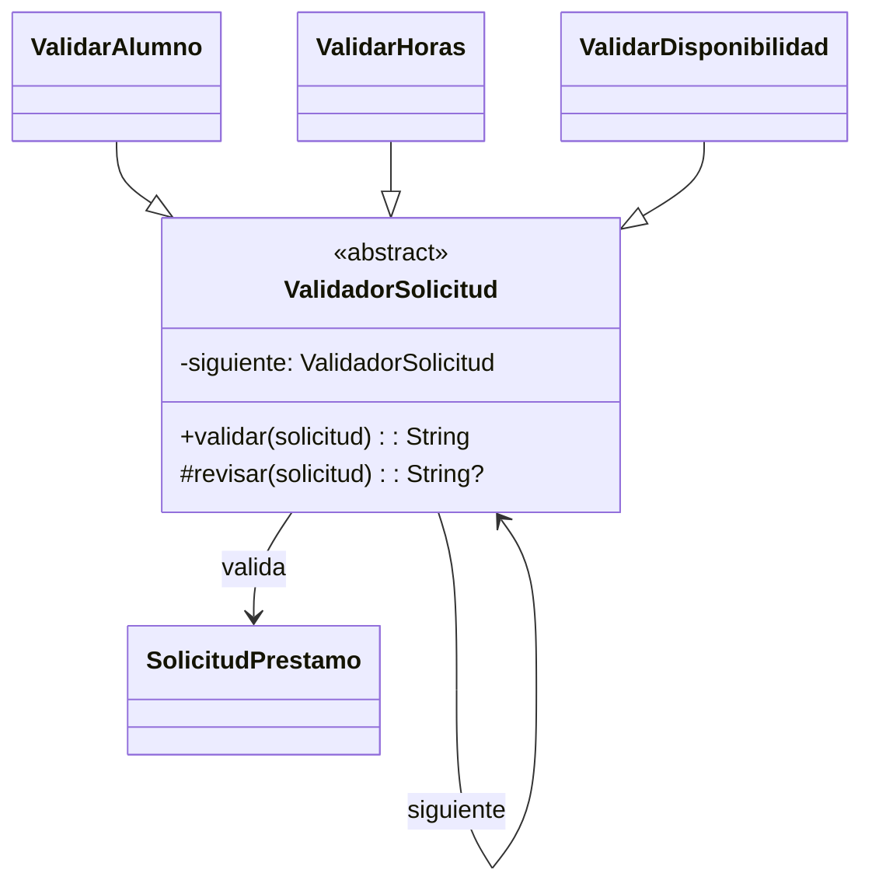

# Chain of Responsibility

## Problema
Una solicitud de préstamo debe pasar por varias validaciones. Si todas se colocan en una sola función, el código crece y cada nueva regla obliga a modificarla.

## Solución
Cada validador revisa una condición. Si no encuentra un error, pasa la solicitud al siguiente elemento de la cadena.

## Diagrama

## Participantes
| Rol | Código |
|---|---|
| Handler | `ValidadorSolicitud` |
| Concrete handlers | `ValidarAlumno`, `ValidarHoras`, `ValidarDisponibilidad` |
| Request | `SolicitudPrestamo` |
| Client | `Demo.kt` |

## Kotlin idiomático
`Idiomatica.kt` reemplaza la jerarquía de validadores por una lista de funciones `(SolicitudPrestamo) -> String?`. Esto reduce clases y líneas, permite leer las reglas como una secuencia y facilita agregar o cambiar su orden.

## Cuándo NO usarlo
- Cuando solamente existe una validación y no cambiará.
- Cuando todas las reglas deben ejecutarse, aunque alguna encuentre un error.

## Patrones relacionados
Se parece a **Decorator**, pero Chain of Responsibility decide si continúa con el siguiente manejador. Decorator agrega responsabilidades alrededor de una operación.