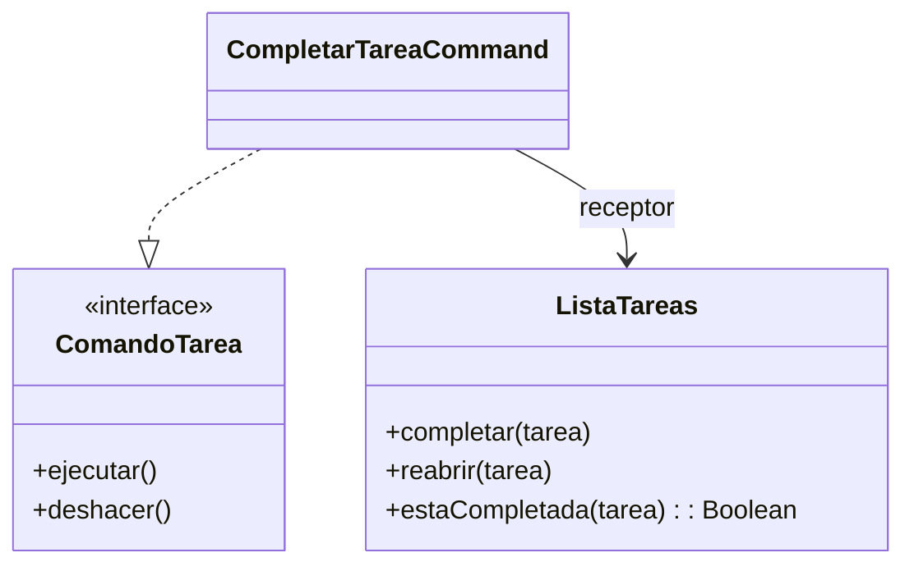

# Command

## Problema
Una interfaz necesita ejecutar acciones y también deshacerlas. Si el botón modifica directamente la lista de tareas, queda unido a los detalles de esa operación.

## Solución
La acción se convierte en un comando que sabe cómo ejecutarse y cómo revertirse.

## Diagrama

## Participantes
| Rol | Código |
|---|---|
| Command | `ComandoTarea` |
| Concrete command | `CompletarTareaCommand` |
| Receiver | `ListaTareas` |
| Client | `Demo.kt` |

## Kotlin idiomático
`ComandoLambda` guarda una función para ejecutar y otra para deshacer. La versión clásica utiliza una interfaz y una clase concreta; la idiomática reduce clases y líneas cuando las acciones son pequeñas.

## Cuándo NO usarlo
- Cuando la acción es directa y nunca será almacenada, repetida o deshecha.
- Cuando crear comandos separados complica un flujo muy sencillo.

## Patrones relacionados
**Memento** puede guardar el estado necesario para deshacer acciones complejas. **Strategy** cambia un algoritmo, mientras Command representa una petición ejecutable.