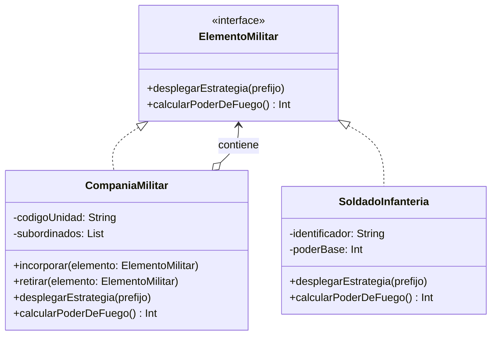

# Patrón Composite (Objeto Compuesto)

## Problema
En el desarrollo de un sistema de simulación militar o estrategia, nos encontramos con que las fuerzas armadas tienen una estructura estrictamente jerárquica (ejércitos compuestos por divisiones, divisiones compuestas por batallones, y batallones formados por soldados individuales). Si el código del cliente tuviera que tratar de manera diferente a los combatientes individuales (hojas) y a los mandos o divisiones (contenedores), las operaciones de despliegue y cálculo de poder de ataque requerirían múltiples sentencias de control y bucles complejos.

## Solución
El patrón **Composite** permite tratar tanto a los objetos individuales como a las agrupaciones de forma uniforme mediante una interfaz común (`ElementoMilitar`). Tanto las hojas individuales (`SoldadoInfanteria`) como los contenedores complejos (`CompaniaMilitar`) implementan los mismos métodos, permitiendo estructurar árboles jerárquicos donde el cliente interactúa de manera transparente.

## Diagrama de Clases

## Participantes
| Rol del Patrón | Clase/Interfaz en el Código | Descripción |
| :--- | :--- | :--- |
| **Component** | `ElementoMilitar` | Interfaz común para todos los objetos de la jerarquía composicional. |
| **Leaf (Hoja)** | `SoldadoInfanteria` | Objeto primitivo que representa una unidad final sin subordinados. |
| **Composite (Compuesto)** | `CompaniaMilitar` | Contenedor de elementos militares que delega las operaciones hacia sus hijos. |
| **Cliente** | `Demo.kt` | Controla y despliega las estructuras jerárquicas a través de la interfaz genérica. |

## Kotlin Idiomático
- **Colecciones mutables encapsuladas:** Uso de `mutableListOf<ElementoMilitar>()` protegido dentro del contenedor para gestionar de manera idiomática el árbol de dependencias.
- **Polimorfismo recursivo:** Aplicación de llamadas recursivas limpias a través de interfaces para recorrer la estructura de comandos sin casteos manuales de tipo.

## Cuándo NO usarlo
1. **Estructuras planas:** Si los elementos de tu software no presentan relaciones de tipo "parte-todo", aplicar este patrón introducirá capas innecesarias.
2. **Interfaces dispares:** Si los nodos hoja y los contenedores manejan contratos de comportamiento completamente distintos, forzar una interfaz única puede vulnerar el principio de segregación de interfaces.

## Patrones Relacionados
- **Decorator:** Envuelve objetos de forma similar, pero cambia responsabilidades sin alterar la interfaz, a diferencia del Composite que unifica estructuras jerárquicas.
- **Visitor:** Permite ejecutar operaciones globales sobre la estructura Composite sin alterar las clases de los nodos individuales.