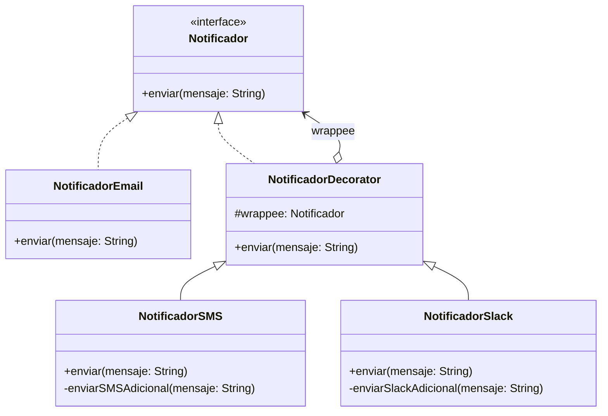

# Patrón Decorator (Decorador)

## Problema
En el desarrollo de un sistema de notificaciones, a menudo necesitamos enviar alertas por correo electrónico (`NotificadorEmail`). Sin embargo, los requerimientos cambian rápidamente y los usuarios demandan añadir dinámicamente canales adicionales (como SMS, Slack o WhatsApp) y combinarlos de cualquier forma posible en tiempo de ejecución (solo email, email + SMS, email + Slack + SMS, etc.). Si intentáramos resolver esto mediante herencia clásica, la explosión combinatoria de subclases (ej. `EmailConSMS`, `EmailConSlack`, `EmailConSMSYSlack`) haría el código totalmente inmanejable.

## Solución
El patrón **Decorator** permite añadir responsabilidades o comportamientos adicionales a un objeto de forma dinámica envolviéndolo en clases contenedoras especiales (los decoradores). El decorador implementa la misma interfaz que el objeto envuelto (`Notificador`), delegando las llamadas originales y añadiendo su propia funcionalidad antes o después, evitando así la creación masiva de subclases.

## Diagrama de Clases

## Participantes
| Rol del Patrón | Clase/Interfaz en el Código | Descripción |
| :--- | :--- | :--- |
| **Component** | `Notificador` | Interfaz común tanto para los objetos base como para los decoradores. |
| **Concrete Component** | `NotificadorEmail` | El objeto básico al cual se le añadirán responsabilidades adicionales. |
| **Base Decorator** | `NotificadorDecorator` | Mantiene la referencia al componente envuelto (`wrappee`) y cumple el contrato de la interfaz. |
| **Concrete Decorator** | `NotificadorSMS`, `NotificadorSlack` | Añaden comportamientos específicos (capas adicionales) antes o después de delegar al componente. |
| **Cliente** | `Demo.kt` | Envuelve y compone los objetos dinámicamente según la necesidad. |

## Kotlin Idiomático
- **Composición de clases abstractas:** Uso de constructores primarios (`protected val wrappee`) para pasar la instancia envuelta de manera limpia, idéntica a cómo opera el patrón Bridge.
- **Inmutabilidad y orden de llamadas:** Capacidad de encadenar constructores en una sola línea de código (ej. `NotificadorSlack(NotificadorSMS(...))`) aprovechando la expresividad de Kotlin.

## Cuándo NO usarlo
1. **Objetos simples y rígidos:** Si el comportamiento de un objeto nunca cambia en tiempo de ejecución y no requiere adiciones dinámicas, aplicar decoradores añade una sobrecarga de indirección innecesaria frente a la herencia directa.
2. **Cuando el orden de las capas importa demasiado y complica la lógica:** Si la permutación de los decoradores altera catastróficamente el resultado esperado, el diseño puede volverse frágil.

## Patrones Relacionados
- **Adapter:** Cambia la interfaz de un objeto existente para hacerlo compatible, mientras que el Decorator mantiene la misma interfaz pero añade responsabilidades.
- **Composite:** Comparte una estructura similar basada en envoltorios, pero el Composite busca unificar estructuras de árbol/jerarquías, mientras que el Decorator se enfoca en añadir comportamientos adicionales sin alterar la interfaz principal.