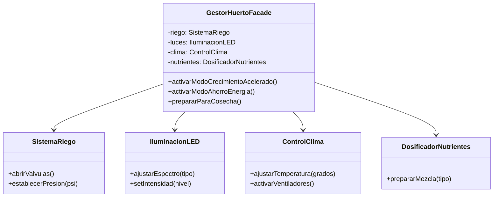

# Patrón Facade (Fachada)

## Problema
En un huerto inteligente moderno, el agricultor se enfrenta a una complejidad técnica abrumadora: debe configurar manualmente la presión del riego, el espectro de las luces LED, el termostato del clima y la mezcla de nutrientes. Olvidar un solo paso o configurar mal un valor puede arruinar la cosecha, y la curva de aprendizaje para operar cada máquina por separado es demasiado alta.

## Solución
El patrón **Facade** introduce una clase "maestra" (`GestorHuertoFacade`) que actúa como un panel de control simplificado. Esta fachada oculta la complejidad técnica de los subsistemas y ofrece métodos intuitivos como "Activar Crecimiento Acelerado". El usuario ya no necesita conocer los detalles internos de cada máquina; solo interactúa con la interfaz amigable de la fachada.

## Diagrama de Clases

## Participantes
| Rol del Patrón | Clase/Interfaz en el Código | Descripción |
| :--- | :--- | :--- |
| **Facade** | `GestorHuertoFacade` | Unifica y delega las llamadas a los subsistemas. |
| **Subsistemas** | `SistemaRiego`, `IluminacionLED`, `ControlClima`, `DosificadorNutrientes` | Clases técnicas que realizan el trabajo específico. |
| **Cliente** | `Demo.kt` | Interactúa solo con la fachada para operar el huerto. |

## Kotlin Idiomático
- **Valores por defecto en el constructor:** Se usó `private val riego: SistemaRiego = SistemaRiego(...)`. Esto permite que el cliente use la fachada de forma sencilla sin pasarle nada (usando los subsistemas reales), pero al mismo tiempo permite la **Inyección de Dependencias** para los tests, pasando versiones simuladas si fuera necesario.
- **String Templates y Visibilidad:** Se usaron `println` con plantillas `${...}` y modificadores `private set` en los modelos para asegurar que solo el subsistema pueda cambiar su estado, pero que la Fachada (y los tests) puedan leerlo.

## Cuándo NO usarlo
1. **Sistemas Simples:** Si solo tienes uno o dos componentes y su uso es directo, añadir una fachada solo añade código innecesario ("Overengineering").
2. **Si el cliente necesita personalización total:** Si el usuario experto necesita tunear cada milímetro de la configuración, la fachada puede convertirse en un cuello de botella que limita el control sobre los subsistemas.

## Patrones Relacionados
- **Adapter:** El Adapter cambia una interfaz para que coincida con otra. El Facade crea una interfaz nueva y más simple.
- **Singleton:** Muchas veces las fachadas se implementan como Singletons, ya que solo suele ser necesaria una instancia del panel de control.
- **Mediator:** Se parece en que centraliza comunicación, pero el Mediator se enfoca en cómo interactúan los objetos entre sí, mientras que el Facade se enfoca en cómo el cliente usa el sistema.
