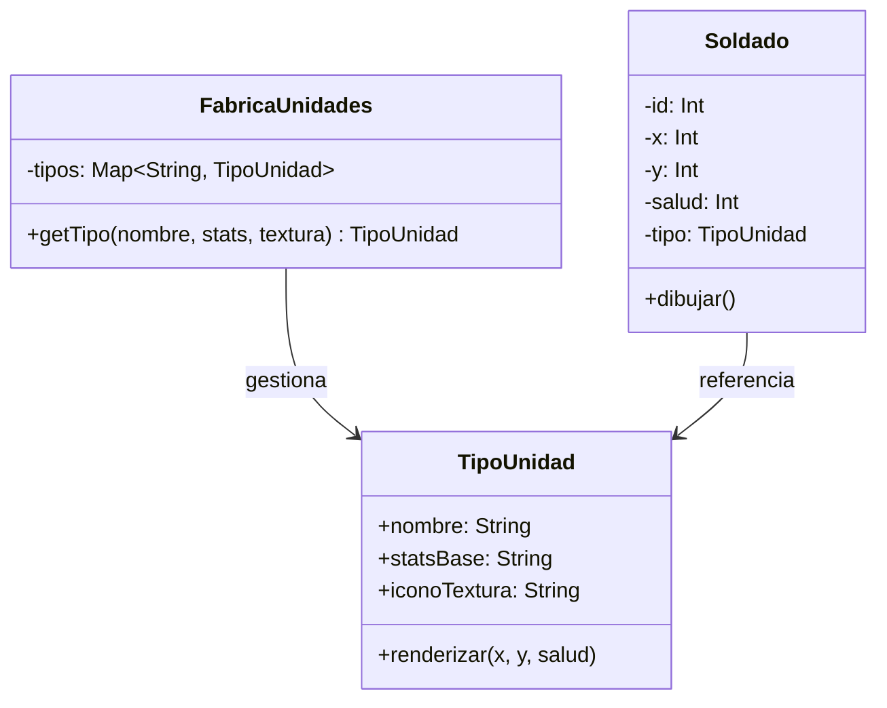

# Patrón Flyweight (Peso Ligero)

## Problema
En un videojuego de estrategia con miles de soldados en pantalla, cada unidad necesita datos pesados como texturas 4K, modelos 3D y animaciones. Si creamos 10,000 objetos `Soldado` y cada uno guarda su propia copia de la textura (ej. 10MB), el juego agotaría la memoria RAM instantáneamente (100GB solo en texturas repetidas).

## Solución
El patrón **Flyweight** divide el estado del objeto en dos:
1. **Estado Intrínseco:** Datos pesados que son iguales para todas las unidades de un tipo (ej. la textura del arquero). Se extraen a una clase compartida.
2. **Estado Extrínseco:** Datos ligeros que son únicos de cada instancia (ej. la posición X, Y en el mapa). 
Usamos una fábrica que garantiza que solo exista una instancia de cada "Estado Intrínseco", ahorrando gigas de memoria.

## Diagrama de Clases

## Participantes
| Rol del Patrón | Clase/Interfaz en el Código | Descripción |
| :--- | :--- | :--- |
| **Flyweight** | `TipoUnidad` | Contiene el estado compartido (intrínseco) y pesado. |
| **Flyweight Factory** | `FabricaUnidades` | Almacena y gestiona los objetos Flyweight. |
| **Contexto** | `Soldado` | Contiene el estado único (extínseco) y una referencia al flyweight. |
| **Cliente** | `Demo.kt` | Crea miles de soldados usando la fábrica. |

## Kotlin Idiomático
- **`object` (Singleton):** Se usó un `object` para la `FabricaUnidades`. En Kotlin, esto garantiza una única instancia de la fábrica en toda la aplicación de forma nativa.
- **`getOrPut`:** Se usó la función de extensión de mapas `getOrPut`. Es una forma elegante y segura de implementar el caché: "si existe dámelo, si no, créalo y guárdalo", todo en una sola línea.

## Cuándo NO usarlo
1. **Si no hay escasez de memoria:** Si solo tienes 10 objetos, la complejidad extra de separar los estados no vale la pena.
2. **Si los objetos no comparten casi nada:** Si cada objeto es totalmente único, el patrón no tiene datos que compartir y solo añade capas innecesarias.

## Patrones Relacionados
- **Composite:** A menudo se combinan; los nodos de un árbol jerárquico pueden ser Flyweights para ahorrar memoria.
- **Singleton:** La fábrica suele ser un Singleton. Se diferencia en que el Singleton es un solo objeto único, mientras que el Flyweight maneja múltiples objetos compartidos.
