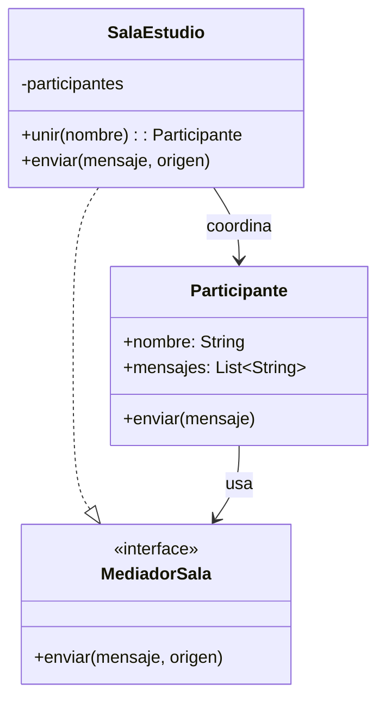

# Mediator

## Problema
Los participantes de una sala podrían guardar referencias y comunicarse directamente entre sí. Al aumentar el grupo, también aumentan las conexiones y el acoplamiento.

## Solución
`SalaEstudio` centraliza el registro y la entrega de mensajes. Los participantes solo conocen al mediador.

## Diagrama

## Participantes
| Rol | Código |
|---|---|
| Mediator | `MediadorSala` |
| Concrete mediator | `SalaEstudio` |
| Colleague | `Participante` |
| Client | `Demo.kt` |

## Kotlin idiomático
Se utilizan funciones de expresión, `also`, `filter` y `forEach` para registrar participantes y distribuir mensajes de forma breve. El patrón conserva su estructura porque sigue siendo necesario un coordinador central.

## Cuándo NO usarlo
- Cuando solo existen dos objetos con una comunicación sencilla.
- Cuando el mediador concentra demasiadas reglas y se vuelve difícil de mantener.

## Patrones relacionados
**Observer** distribuye eventos a suscriptores. Mediator coordina la comunicación entre objetos y puede decidir quién recibe cada mensaje.