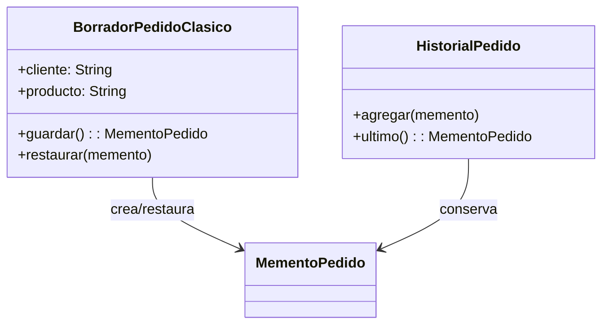

````markdown
# Memento

## Problema
Un borrador de pedido puede modificarse por error. Se necesita recuperar un estado anterior sin exponer ni reconstruir manualmente todos sus datos.

## Solución
El borrador crea una instantánea de su estado. El historial la conserva y puede devolverla para restaurar el objeto.

## Diagrama


## Participantes
| Rol | Código |
|---|---|
| Originator | `BorradorPedidoClasico` |
| Memento | `MementoPedido` |
| Caretaker | `HistorialPedido` |
| Client | `Demo.kt` |

## Kotlin idiomático
La instantánea se representa con `data class EstadoPedido`, que es inmutable y compara sus valores automáticamente. Esto reduce el código de la versión clásica y hace explícito que el objeto solo guarda datos.

## Cuándo NO usarlo
- Cuando el objeto tiene un estado pequeño que puede recalcularse fácilmente.
- Cuando se guardarían demasiadas instantáneas grandes y el consumo de memoria sería alto.

## Patrones relacionados
**Command** puede utilizar Memento para deshacer operaciones. Memento guarda estado; Command encapsula una acción.
````