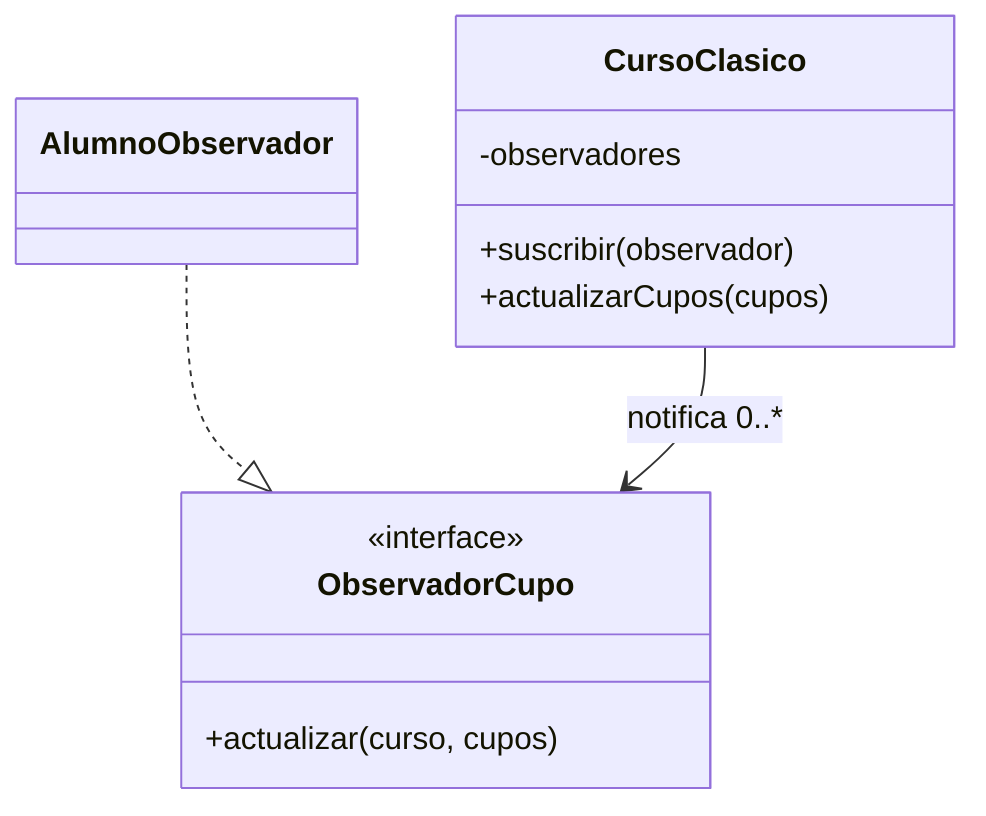

```markdown
# Observer

## Problema
Varios alumnos quieren enterarse cuando cambien los cupos de un curso. Si el curso conoce y actualiza manualmente a cada alumno, queda fuertemente acoplado a ellos.

## Solución
Los interesados se suscriben como observadores. Cuando cambia el cupo, el curso recorre la lista y envía la notificación.

## Diagrama


## Participantes
| Rol | Código |
|---|---|
| Subject | `CursoClasico` |
| Observer | `ObservadorCupo` |
| Concrete observer | `AlumnoObservador` |
| Client | `Demo.kt` |

## Kotlin idiomático
`CursoIdiomatico` usa lambdas como observadores y `Delegates.observable` para detectar el cambio de la propiedad. Así se evita crear una clase observadora cuando solo se necesita ejecutar una función.

## Cuándo NO usarlo
- Cuando solo existe un receptor fijo y una llamada directa es más clara.
- Cuando el orden de las notificaciones debe controlarse estrictamente y hay muchas dependencias entre observadores.

## Patrones relacionados
**Mediator** coordina la interacción entre participantes; Observer publica cambios sin conocer la lógica de cada suscriptor.
````