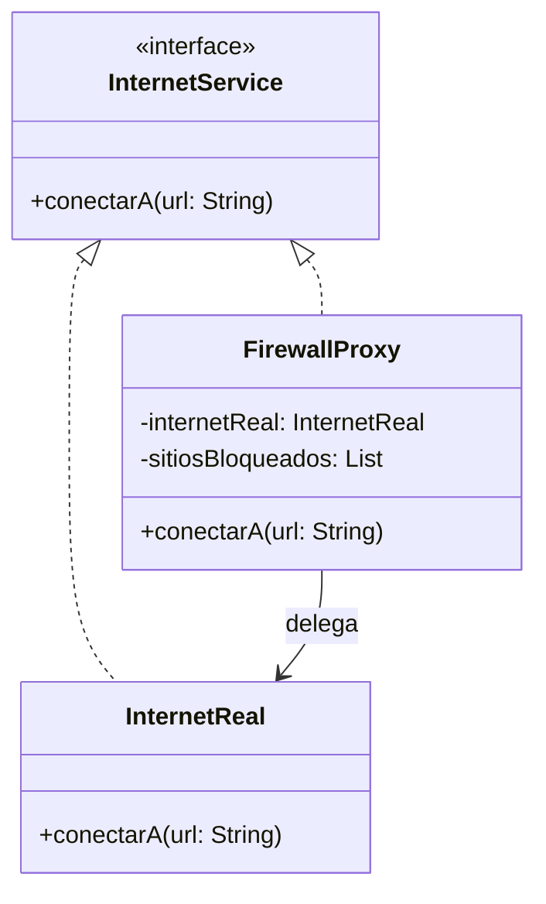

# Patrón Proxy (Sustituto)

## Problema
En una red corporativa, permitir que todos los empleados accedan libremente a cualquier sitio web de Internet puede generar problemas de productividad y riesgos de seguridad. Sin embargo, no queremos modificar el sistema de red original (`InternetReal`) para añadirle reglas de filtrado, ya que eso violaría el principio de responsabilidad única y contaminaría un servicio técnico con reglas de negocio cambiantes.

## Solución
Implementamos un **Proxy de Protección** (`FirewallProxy`). Este objeto tiene la misma interfaz que el servicio de internet real, por lo que el cliente no nota la diferencia. El Proxy actúa como un intermediario: intercepta cada petición, verifica si el sitio solicitado está en una "lista negra" y solo si el sitio es seguro, le pasa la petición al servicio de internet real.

## Diagrama de Clases

## Participantes
| Rol del Patrón | Clase/Interfaz en el Código | Descripción |
| :--- | :--- | :--- |
| **Subject** | `InternetService` | Interfaz común que define el contrato. |
| **Real Subject** | `InternetReal` | El objeto real que realiza la conexión final. |
| **Proxy** | `FirewallProxy` | El intermediario que controla el acceso y aplica el filtro. |
| **Cliente** | `Demo.kt` | Usa el servicio a través de la interfaz compartida. |

## Kotlin Idiomático
- **Custom Exceptions:** Se creó `AccesoDenegadoException` para manejar los bloqueos de forma elegante y testable, en lugar de solo imprimir texto.
- **Any con Predicados:** Se usó la función de extensión `sitiosBloqueados.any { ... }` para realizar la búsqueda de forma declarativa y limpia, aprovechando las lambdas de Kotlin.
- **Lazy Initialization (Opcional):** El Proxy permite que el `InternetReal` se inicialice solo cuando sea necesario, ahorrando recursos si nunca se hace una conexión válida.

## Cuándo NO usarlo
1. **Si no hay control de acceso necesario:** Si solo vas a delegar la llamada sin hacer nada más, el Proxy es una capa de redirección inútil.
2. **Si el rendimiento es crítico:** Cada capa intermedia añade un pequeño retraso (latencia). En sistemas de tiempo real extremo, demasiados Proxies pueden ser un problema.

## Patrones Relacionados
- **Adapter:** El Adapter cambia la interfaz; el Proxy la mantiene idéntica.
- **Decorator:** El Decorador añade funcionalidades (comportamiento); el Proxy controla el acceso (gestión de vida, seguridad, etc.).
- **Facade:** La Fachada simplifica un sistema complejo; el Proxy representa a un solo objeto para controlarlo.
