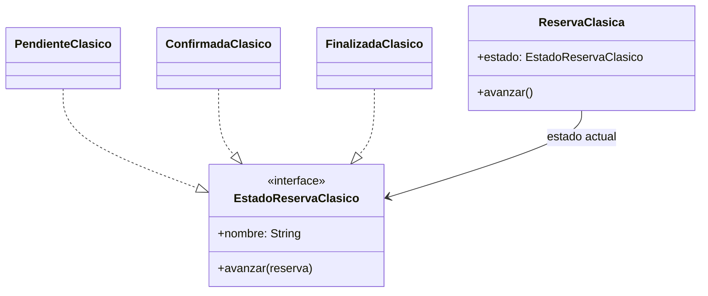

# State

## Problema
Una reservación cambia su comportamiento según esté pendiente, confirmada o finalizada. Resolverlo con muchos `if` dispersos hace difícil controlar las transiciones válidas.

## Solución
El estado actual se representa por separado. Cada estado clásico decide cuál es el siguiente, mientras el contexto delega la transición.

## Diagrama

## Participantes
| Rol | Código |
|---|---|
| State | `EstadoReservaClasico` |
| Concrete states | `PendienteClasico`, `ConfirmadaClasico`, `FinalizadaClasico` |
| Context | `ReservaClasica` |
| Client | `Demo.kt` |

## Kotlin idiomático
La versión idiomática usa `sealed interface` y un `when` exhaustivo. El compilador obliga a considerar todos los estados y evita crear una clase completa cuando la transición es pequeña.

## Cuándo NO usarlo
- Cuando solo existen dos estados simples que no modifican el comportamiento.
- Cuando las transiciones casi nunca cambian y una propiedad booleana expresa mejor la situación.

## Patrones relacionados
**Strategy** cambia un algoritmo por decisión del cliente. State cambia el comportamiento por el estado interno y controla sus transiciones.