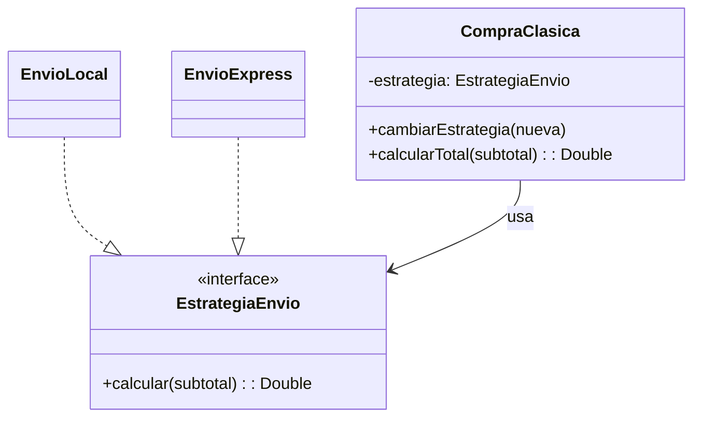

# Strategy

## Problema
Una compra puede usar diferentes formas de calcular el envío. Colocar todas las opciones dentro de la compra produciría condiciones y obligaría a modificarla al agregar otra tarifa.

## Solución
Cada cálculo de envío se separa como una estrategia intercambiable. La compra solo llama a la estrategia seleccionada.

## Diagrama

## Participantes
| Rol | Código |
|---|---|
| Strategy | `EstrategiaEnvio` |
| Concrete strategies | `EnvioLocal`, `EnvioExpress` |
| Context | `CompraClasica` |
| Client | `Demo.kt` |

## Kotlin idiomático
La estrategia se expresa como `(Double) -> Double` mediante `typealias`. La versión clásica requiere una interfaz y una clase por tarifa; la idiomática puede recibir una lambda y mantiene el mismo punto de extensión.

## Cuándo NO usarlo
- Cuando solo existe una forma fija de calcular el envío.
- Cuando las variantes son mínimas y una función con un parámetro sencillo resulta más clara.

## Patrones relacionados
**State** también cambia comportamiento, pero sus cambios dependen del estado interno. Strategy es elegida desde fuera para sustituir un algoritmo.
