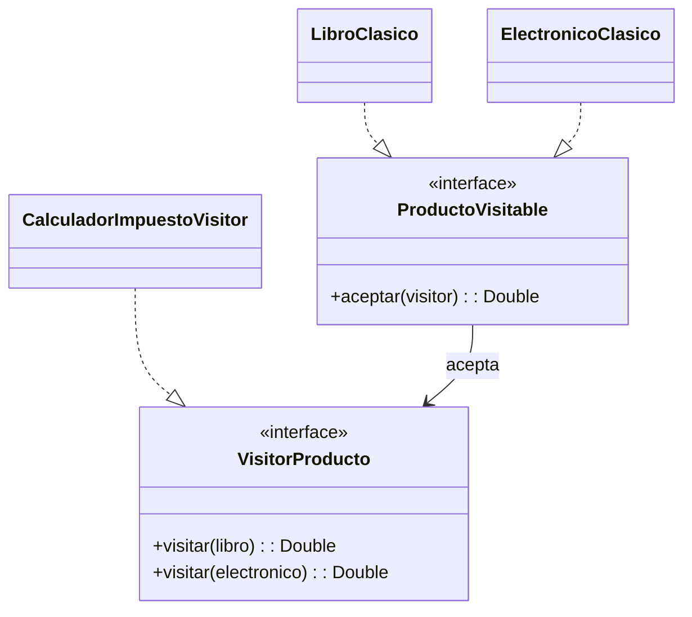

# Visitor

## Problema
Se necesita calcular impuestos distintos para varios tipos de producto. Agregar cada operación dentro de los productos los llenaría de responsabilidades que no pertenecen a su modelo principal.

## Solución
Cada producto acepta un visitante. El visitante contiene una operación diferente para cada tipo concreto y puede agregarse otra operación sin cambiar las clases de producto.

## Diagrama

## Participantes
| Rol | Código |
|---|---|
| Element | `ProductoVisitable` |
| Concrete elements | `LibroClasico`, `ElectronicoClasico` |
| Visitor | `VisitorProducto` |
| Concrete visitor | `CalculadorImpuestoVisitor` |

## Kotlin idiomático
La alternativa usa `sealed interface Producto` y un `when` exhaustivo. Para una jerarquía cerrada, Kotlin puede sustituir el double dispatch con menos código y avisar si aparece un tipo no contemplado.

## Cuándo NO usarlo
- Cuando la jerarquía cambia con frecuencia, porque cada nuevo tipo obliga a modificar todos los visitantes.
- Cuando solo existe una operación sencilla y colocarla en cada clase es más claro.

## Patrones relacionados
**Strategy** cambia un algoritmo para un contexto. Visitor agrega operaciones sobre varios tipos de una jerarquía sin mover esas operaciones a los elementos.
